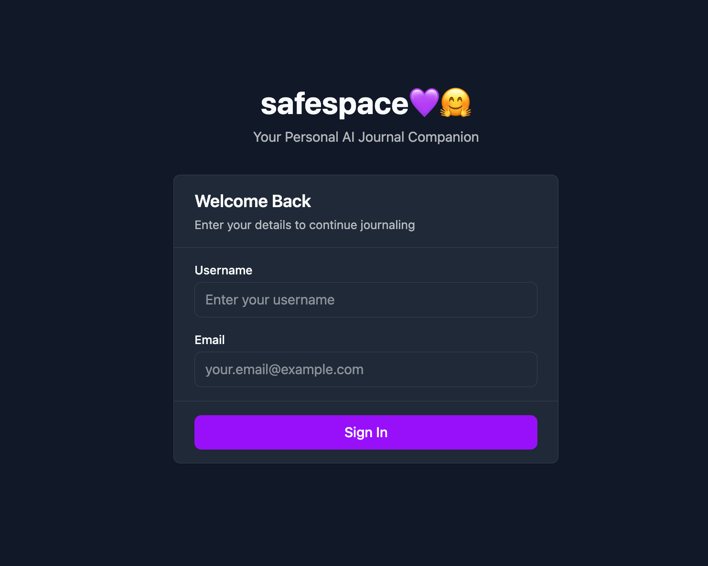
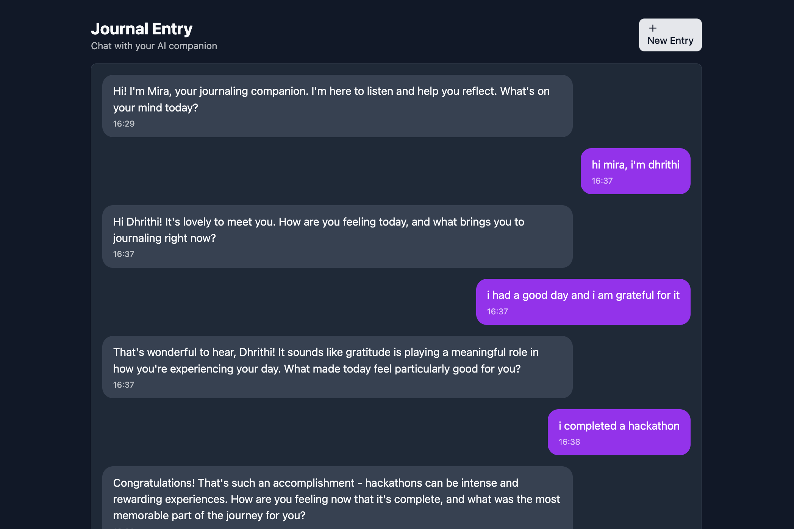
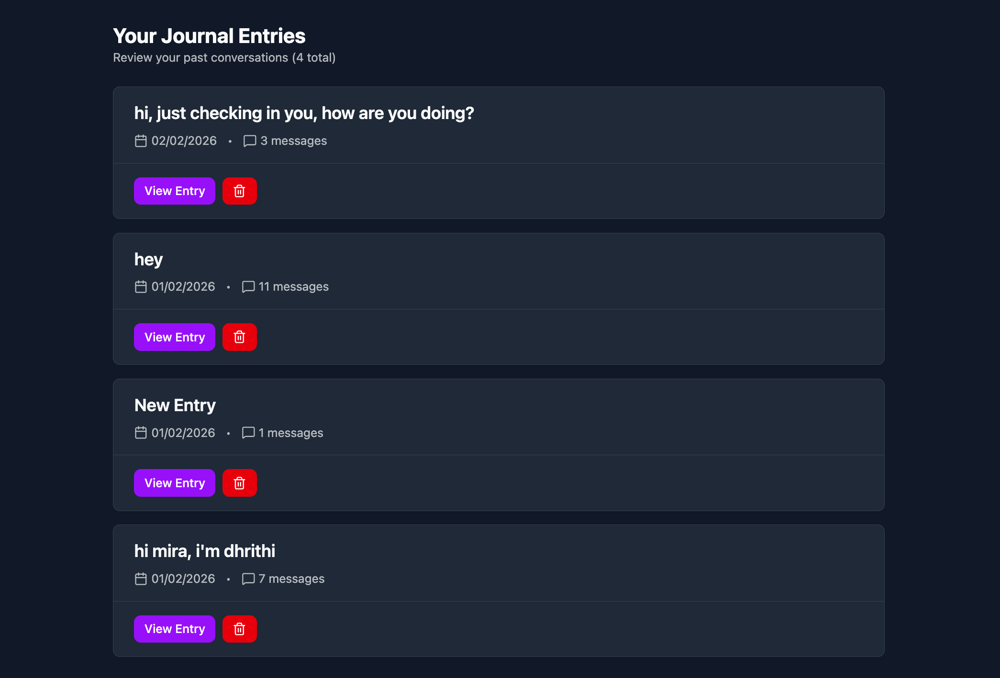
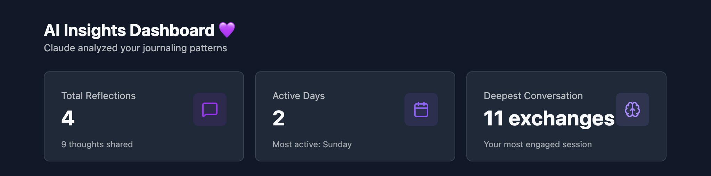
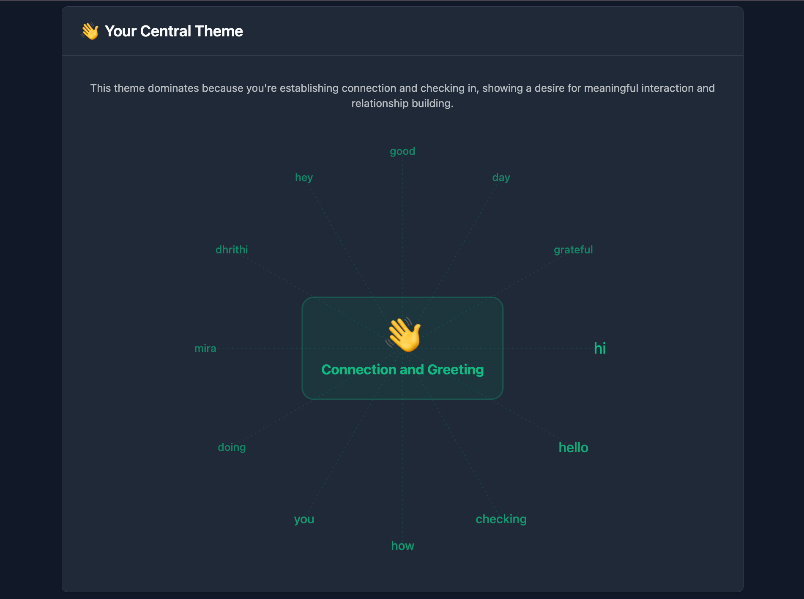
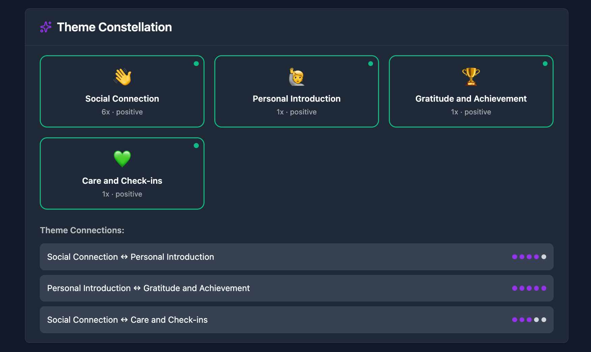
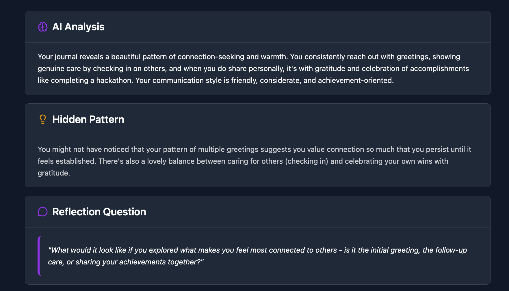

# **safespace** 🌱💜 

**safespace** is a personal AI journal companion where you can reflect in conversation with a supportive listener.  
It helps you capture thoughts, revisit past entries, and see gentle insights about your journaling journey—all in one calm place.

---

> *"Every thought is a seed. Give it a little light, a little care, and watch what grows."* 🌱

---
- Website - https://panw-hackathon-journal-casestudy.vercel.app/
- Demo link - https://www.loom.com/share/e242d41c39e847489db86699d2ede06b

## Features

- 🤖 **AI Chat Companion** - Journal through natural conversation with Claude
- 💭 **Smart Insights** - AI analyzes your entries to find patterns and themes
- 🌸 **Word Cloud Visualization** - See your dominant themes at a glance
- 🌟 **Theme Constellation** - Discover connections between different aspects of your life
- 🌓 **Dark Mode** - Easy on the eyes, day or night
- 💾 **Persistent Storage** - Your entries are saved locally

## 📸 Screenshots

### Login Page


### Chat Interface


### Journal Entries


### AI Insights Dashboard


### Wordcloud


### theme constellation


### ai-powered



## What It Does

- **New Entry** — Start a chat-style journal session with **Mira**, an empathetic AI companion. She greets you, asks follow-ups, and keeps the tone warm and non-judgmental. Each conversation is saved as a journal entry.
- **My Entries** — Browse all past journal sessions. Open any entry to continue or reread, or remove entries you no longer need. Entries are listed by date with a short preview.
- **Insights** — See a dashboard of your journaling habits: total reflections, active days, longest conversation, and most active day. **Word Cloud** shows your central theme with related words orbiting around it (driven by Claude’s analysis of your entries). **Theme Constellation** displays core themes with sentiment, frequency, and connections between themes. You also get an AI narrative, a hidden pattern, and a reflection question to keep the practice going.
- **Theme & identity** — Toggle between light and dark mode. Sign in with a username and email (stored locally) so the app can greet you and keep your data tied to your session.

---

## Design Overview

The app is built to be **simple, fast, and easy to understand**. The frontend focuses on a small set of screens and clear actions; the backend exposes a minimal API; and the AI layer is isolated so you can switch between a real model and a mock without changing the rest of the app.

**Design choices**

- **Conversations that flow** — Journal entries are chat threads with the AI, so writing feels like talking to someone who listens and reflects back.
- **Hybrid storage** — Journal sessions use the backend database (SQLite by default, PostgreSQL in production) when available, with localStorage fallback for compatibility. User identity is still client-side for now.
- **Single AI persona** — One companion (Mira) with a fixed, supportive personality keeps the experience consistent and safe (e.g. no medical advice, gentle signposting if someone is in distress).
- **Insights from your data** — The Insights page derives stats from your stored sessions and sends a summary to the AI for deeper analysis. Claude returns a central theme and related words (powering the **Word Cloud**) and core themes with connections (the **Theme Constellation**), plus narrative, hidden pattern, and a reflection question—so the app feels responsive to your own history.

---

## Tech Stack

| Layer   | Choices |
|--------|---------|
| **Frontend** | React 19, TypeScript, Vite. Styling with Tailwind CSS; UI built from modular components (e.g. Card, Button, Input). React context for auth and theme. React Router for navigation. |
| **Backend**  | FastAPI with CORS enabled. Thin API that receives chat history and forwards it to the AI layer. Pydantic for request/response models. |
| **AI**       | Anthropic Claude (e.g. Claude Sonnet) via the official SDK, with a dedicated system prompt for Mira. Optional **mock AI** returns predefined empathetic replies so the app can run without an API key. |

---

## API Endpoints

- **POST `/api/chat`** — Sends the current conversation (messages + user id) to the AI and returns Mira’s reply and a timestamp.
- **GET `/api/opening-prompt`** — Returns the initial greeting message shown when you start a new journal entry.
- **POST `/api/insights/unified`** — Sends a summary of your entries (dates, message counts, sample user messages) to the AI and returns unified insights: central theme, related words for the **Word Cloud**, core themes and connections for the **Theme Constellation**, plus narrative, hidden pattern, and reflection question.

The backend also exposes a root message and a **GET `/health`** endpoint for liveness checks.

---

## Running Tests

### Backend (pytest)
```bash
cd backend
pip install pytest pytest-asyncio  # if not already installed
python -m pytest tests/ -v
```

### Frontend (Vitest)
```bash
cd frontend
npm install
npm run test:run
```

Tests cover:
- **Backend**: API endpoints (chat, opening prompt, insights), Pydantic models, mock AI service, config, and Anthropic service behavior
- **Frontend**: Utils, API service, Auth/Theme contexts, Login/Chat/Entries/Insights pages, UI components (Button, Input, Card, WordCloud, ThemeToggle)

---

## Future Enhancements

- **Persistence** — Journal sessions now use SQLite/PostgreSQL. Next: move user accounts to proper auth (e.g. Supabase) and add cloud sync.
- **Auth** — Replace demo login with proper sign-up/sign-in (e.g. email magic link or OAuth).
- **Richer insights** — Sentiment over time, simple mood tags, or weekly summaries, still with a privacy-first approach.
- **Export** — Download your entries (e.g. PDF or Markdown) for backup or printing.
- **Safety** — Stronger content guidelines, rate limits, and audit logging for production use.

---

## Summary

**safespace** is a minimal, feature-driven journaling app: chat with an AI companion, keep all entries in one place, and get light insights and encouragement—all wrapped in a calm, readable UI with theme support and a clear path from “new entry” to “insights.” The stack is chosen for clarity and maintainability, and the AI is designed to stay supportive and bounded. 🌱


