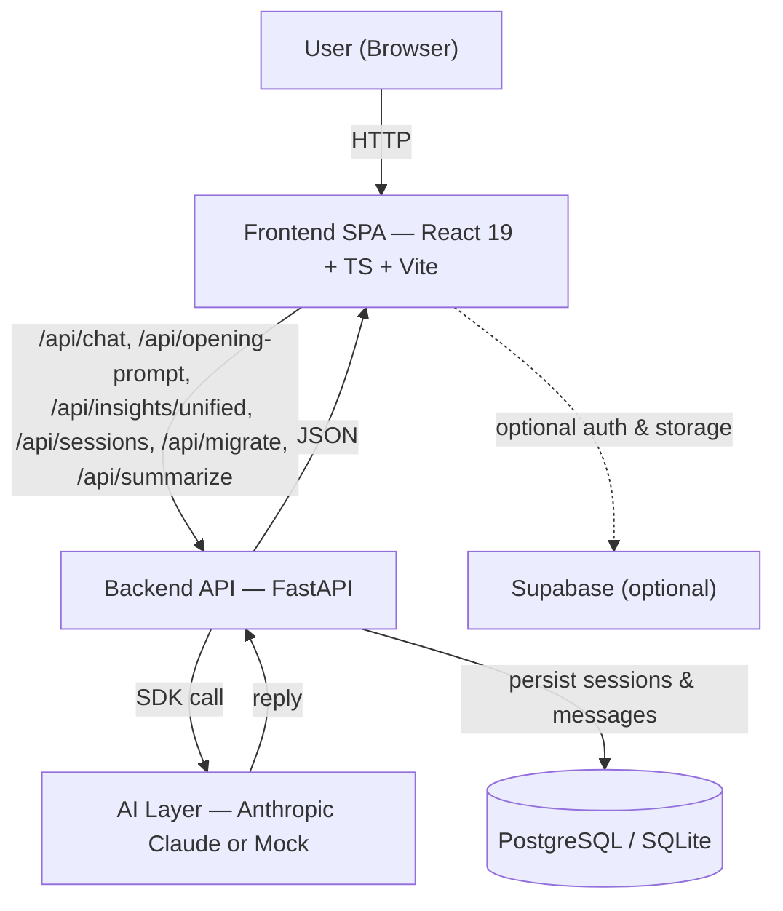
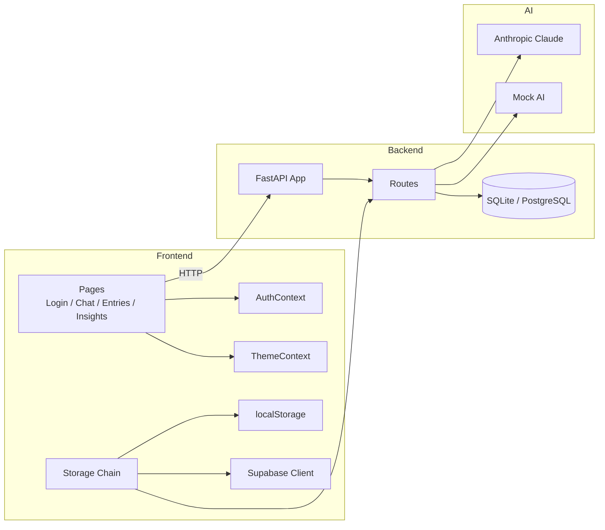
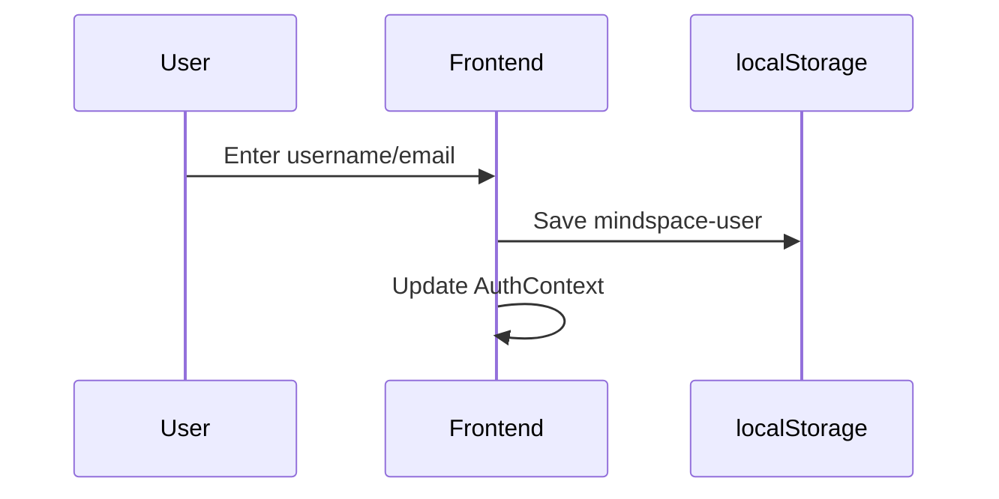
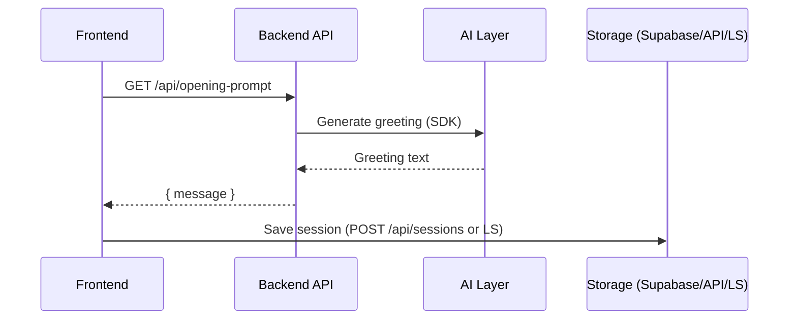
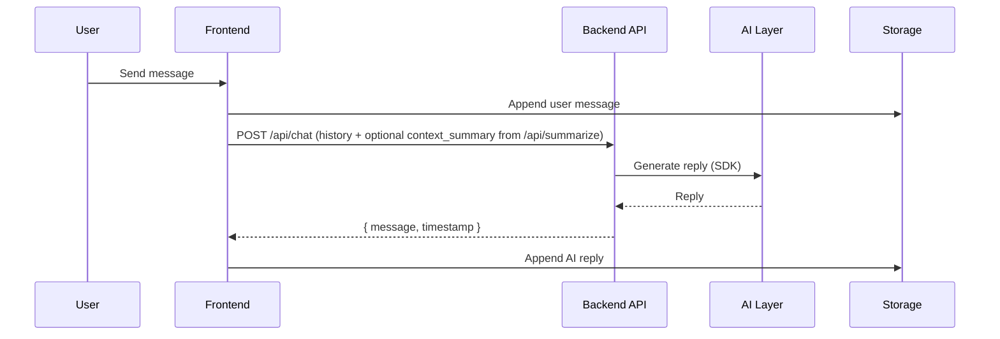
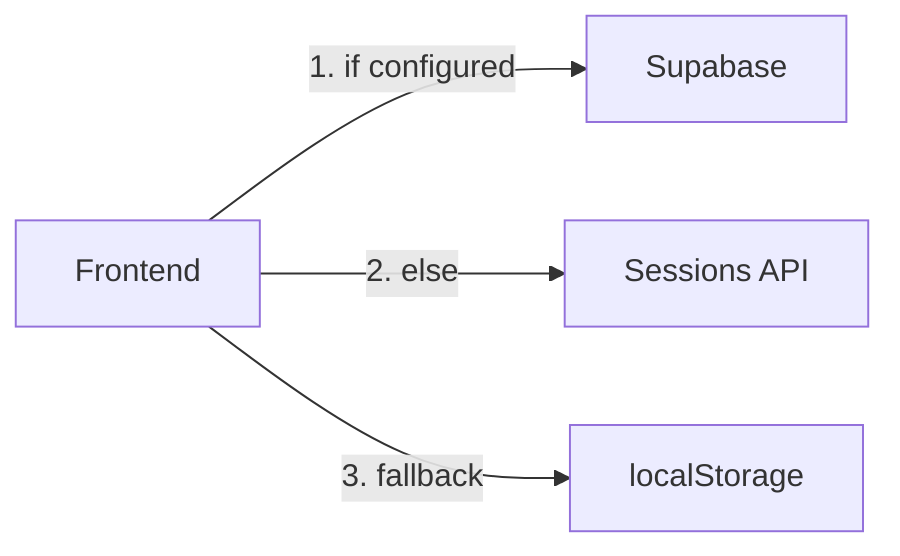
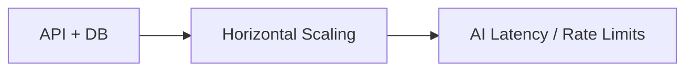
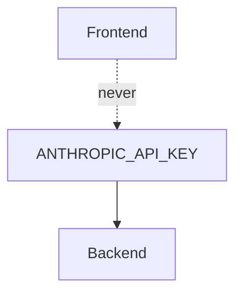

# safespace — System Design & Deployments

> Diagrams use Mermaid. GitHub renders Mermaid blocks in markdown; the repo also includes a GitHub Actions workflow to render diagrams to SVG into docs/diagrams/.

## 1. High-level architecture

System overview



Key properties

- **Hybrid storage** — Supabase (optional) → PostgreSQL via API → localStorage fallback
- Backend persists sessions and messages when using the sessions API
- AI is a replaceable implementation detail (Claude or mock)

---

## 2. Component breakdown

Component responsibilities



Storage chain (order): Supabase (if configured) → Sessions API (PostgreSQL) → localStorage

---

## 3. Data flow (end-to-end)

### Login flow

**Demo mode** (no Supabase):



**Supabase mode** (when configured): Sign in / sign up via Supabase; AuthContext updates with session.

### New session (opening prompt)



### Chat message round-trip



Key design choices:
- Backend receives full history from frontend (history-agnostic).
- Older messages are summarized via `/api/summarize`; recent messages (up to 30) sent as-is.

---

## 4. API surface

API contract map

```mermaid
flowchart LR
    FE[Frontend]
    BE[Backend API]

    FE -->|GET /| BE
    FE -->|GET /health| BE
    FE -->|GET /api/opening-prompt| BE
    FE -->|POST /api/chat| BE
    FE -->|POST /api/summarize| BE
    FE -->|POST /api/insights/unified| BE
    FE -->|GET /api/sessions| BE
    FE -->|POST /api/sessions| BE
    FE -->|GET /api/sessions/{id}| BE
    FE -->|PUT /api/sessions/{id}/messages| BE
    FE -->|DELETE /api/sessions/{id}| BE
    FE -->|POST /api/migrate| BE
```

API examples (add to README or API reference):

- GET /api/opening-prompt
  - Response 200:
  ```json
  {
    "message": "Hi — welcome to your safe space. What would you like to talk about today?",
    "session_hint": "suggested-session-title"
  }
  ```

- POST /api/chat
  - Request:
  ```json
  {
    "session_id": "optional-session-id",
    "history": [
      {"role": "user", "text": "Hello", "ts": 1670000000},
      {"role": "assistant", "text": "Hi there!", "ts": 1670000001}
    ]
  }
  ```
  - Response 200:
  ```json
  {
    "message": "Thanks for sharing — here's a supportive reply...",
    "timestamp": 1670000002
  }
  ```

---

## 4.1 Storage & migration

### Storage chain



localStorage keys (fallback): `mindspace-user`, `mindspace-session-{id}`, `mindspace-current-session`, `mindspace-theme`, `mindspace-migrated`

### Migration flow

On first auth, the frontend detects `mindspace-session-*` in localStorage and migrates to Supabase or `POST /api/migrate`. After migration, `mindspace-migrated` is set and local sessions may be cleared.

---

## 5. Scaling & security model

### Scaling characteristics



Notes:
- Scale frontend via CDN/edge.
- Backend stores sessions in PostgreSQL (or SQLite in dev); sessions API enables sync across devices.
- AI provider rate limits and latency remain the main bottleneck.

### Security boundaries



Security measures:
- **API key** — Only in backend env; never sent to frontend.
- **Rate limiting** — Per-IP limits (e.g. 60/min) via slowapi.
- **Body limit** — Request body size capped (e.g. 1MB) before CORS.
