# safespace — System Design & Deployments (Diagram-First)

> Diagrams use Mermaid. GitHub renders Mermaid blocks in markdown; the repo also includes a GitHub Actions workflow to render diagrams to SVG into docs/diagrams/.

## 1. High-level architecture

System overview

```mermaid
flowchart TB
    User[User<br/>(Browser)]
    FE[Frontend SPA<br/>React + TS + Vite]
    BE[Backend API<br/>FastAPI on Railway]
    AI[AI Layer<br/>Anthropic Claude or Mock]

    User -->|HTTP| FE
    FE -->|HTTPS<br/>/api/chat<br/>/api/opening-prompt| BE
    BE -->|SDK call / HTTPS| AI
    AI -->|reply| BE
    BE -->|JSON| FE
```

Key properties

- Frontend owns all persistence
- Backend is stateless
- AI is a replaceable implementation detail

---

## 2. Component breakdown

Component responsibilities

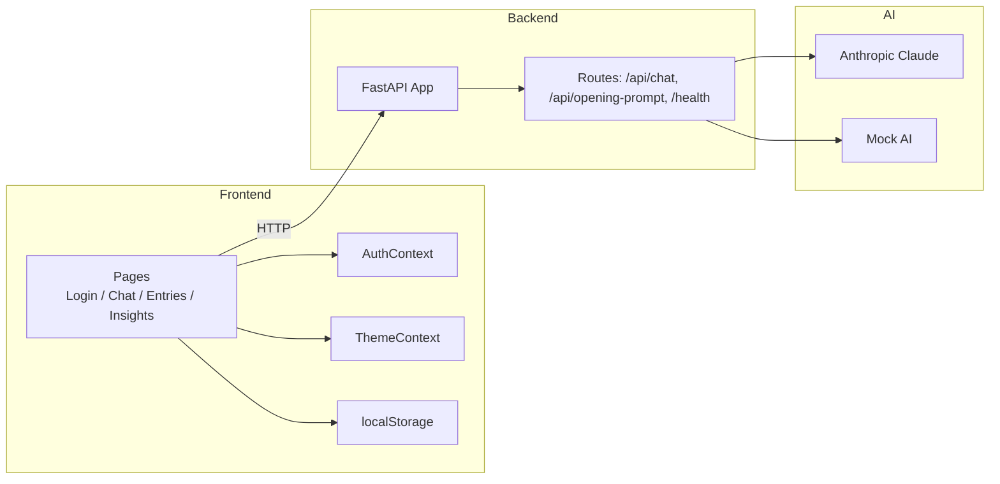

---

## 3. Data flow (end-to-end)

### Login flow (no backend)

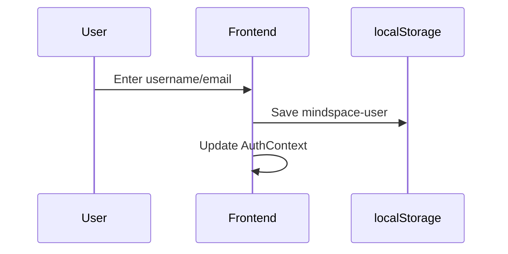

Invariant:
No backend authentication, no tokens, no network calls.

### New session (opening prompt)

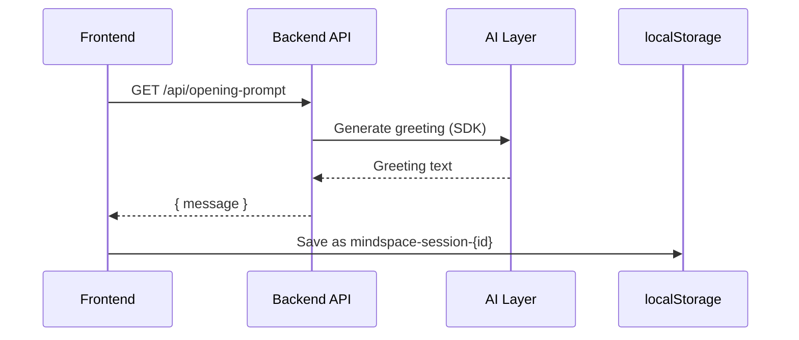

### Chat message round-trip

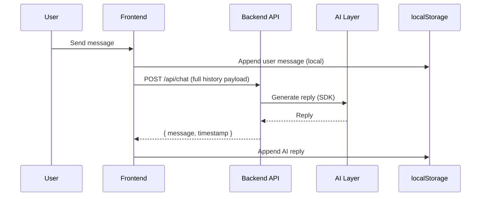

Key design choice:
The backend is history-agnostic — it only echoes what the frontend sends.

---

## 4. Entries & insights (pure client-side)

### Entries page

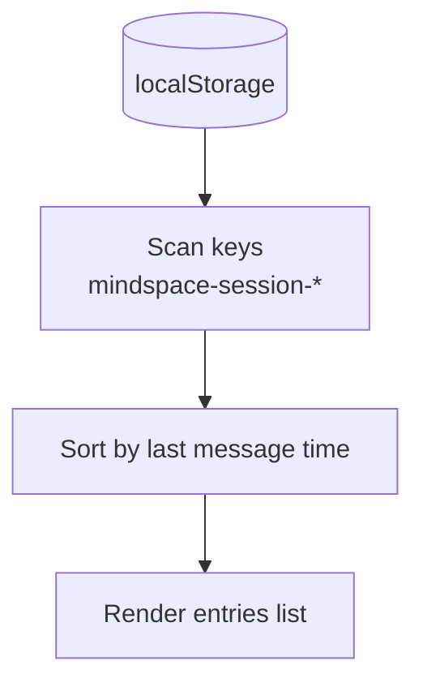

### Insights dashboard

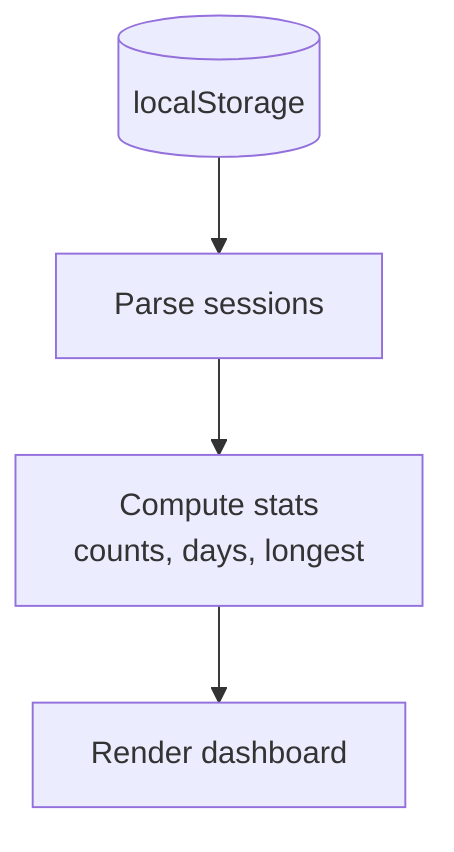

Invariant:
No backend calls after initial page load.

---

## 5. Storage model

Frontend storage schema

```mermaid
classDiagram
    class localStorage {
        +mindspace-user
        +mindspace-theme
        +mindspace-current-session
        +mindspace-session-{id}
    }

    class Session {
        +id
        +messages[]
        +timestamps
    }

    localStorage --> Session : contains
```

Backend storage

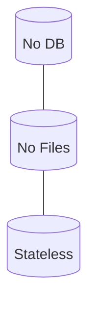

---

## 6. API surface

API contract map

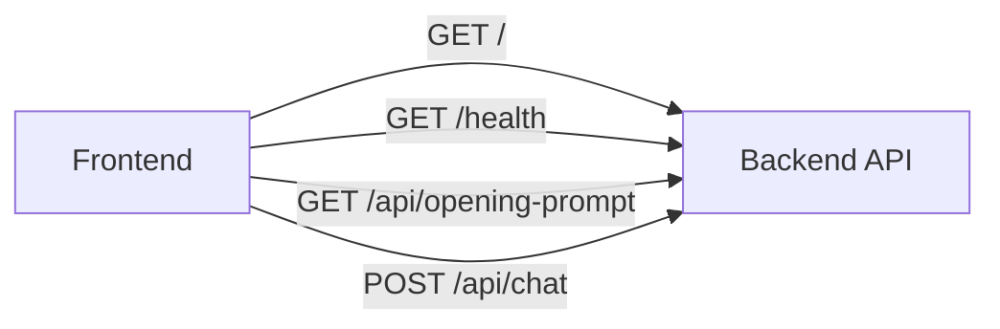

API examples (add to README or API reference):

- GET /api/opening-prompt
  - Response 200:
  ```json
  {
    "message": "Hi ��� welcome to your safe space. What would you like to talk about today?",
    "session_hint": "suggested-session-title"
  }
  ```

- POST /api/chat
  - Request:
  ```json
  {
    "session_id": "optional-session-id",
    "history": [
      {"role": "user", "text": "Hello", "ts": 1670000000},
      {"role": "assistant", "text": "Hi there!", "ts": 1670000001}
    ]
  }
  ```
  - Response 200:
  ```json
  {
    "message": "Thanks for sharing — here's a supportive reply...",
    "timestamp": 1670000002
  }
  ```

Notes:
- The backend does not persist history; it returns responses based solely on the payload provided.

---

## 7. Deployment topology

### Production deployment

```mermaid
flowchart TB
    Browser[User Browser]
    Host[Static Host<br/>Vercel / Netlify / Cloudflare Pages]
    Railway[Railway (FastAPI)]
    AI[Anthropic Claude]

    Browser --> Host
    Host -->|HTTPS| Railway
    Railway -->|SDK / HTTPS| AI
```

### Backend deployment

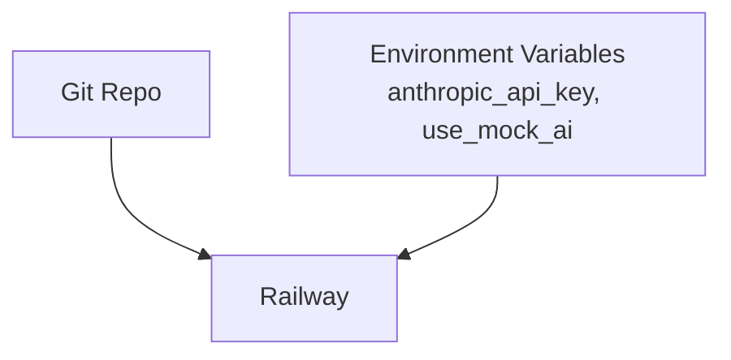

### Frontend build & config

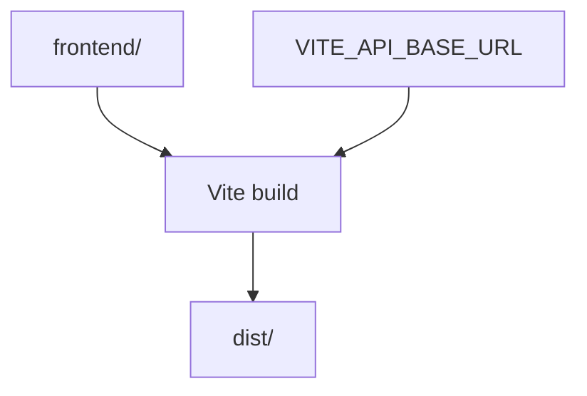

---

## 8. Scaling & security model

### Scaling characteristics

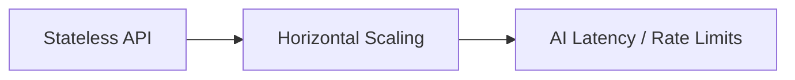

Notes:
- Scale frontend via CDN/edge.
- Backend scales horizontally, but AI provider rate limits and latency are the main bottleneck.
- Consider caching repeated identical prompts if appropriate and safe.

### Security boundaries

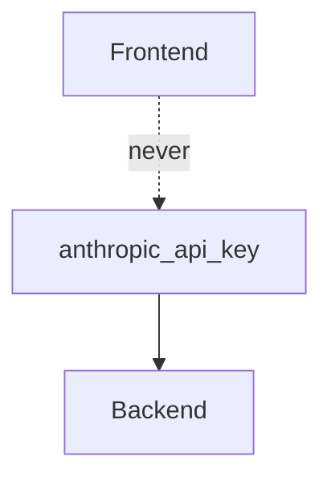

Recommendations:
- Store anthropic_api_key in Railway/environment secrets.
- Use use_mock_ai=true in staging for safe dev/testing without the live provider.

---

## 9. Architectural summary (single diagram)

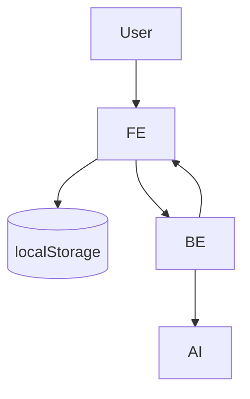

---

## Files generated by the diagram-render workflow

Rendered SVGs will be placed under:
- docs/diagrams/<markdown-filename>-diagram-<n>.svg

(You can ignore or add docs/diagrams/ to .gitignore if you prefer not to commit generated images.)
